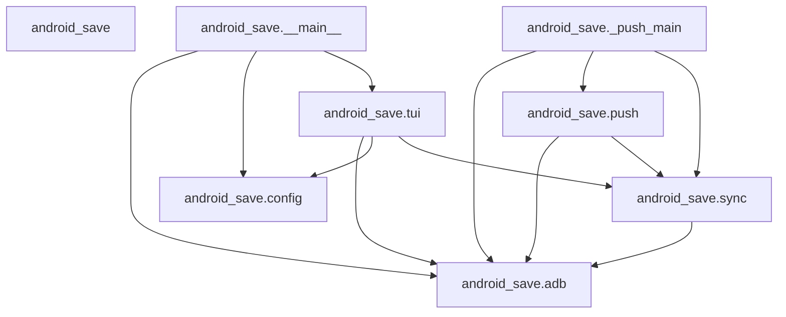

# Architecture — android-save

_Généré automatiquement depuis le code source (2026-07-03) — repasse par la touche **m** pour régénérer après modification._

```mermaid
flowchart TD
    n_android_save["android_save"]
    n_android_save___main__["android_save.__main__"]
    n_android_save__push_main["android_save._push_main"]
    n_android_save_adb["android_save.adb"]
    n_android_save_config["android_save.config"]
    n_android_save_push["android_save.push"]
    n_android_save_sync["android_save.sync"]
    n_android_save_tui["android_save.tui"]
    n_android_save___main__ --> n_android_save_adb
    n_android_save___main__ --> n_android_save_config
    n_android_save___main__ --> n_android_save_tui
    n_android_save__push_main --> n_android_save_adb
    n_android_save__push_main --> n_android_save_push
    n_android_save__push_main --> n_android_save_sync
    n_android_save_push --> n_android_save_adb
    n_android_save_push --> n_android_save_sync
    n_android_save_sync --> n_android_save_adb
    n_android_save_tui --> n_android_save_adb
    n_android_save_tui --> n_android_save_config
    n_android_save_tui --> n_android_save_sync
```
